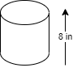

# 3d shapes

## Rectangular prism

### Volume

The volume of a rectangular prism is the base * height * length or, the area of base multiplied by the height. 

The area of the base is the length multiplied by the base, but in the end your just multiplying the length, base, and the height.

### Exercises

#### Exercise 1
If the length of a rectangular prism is 17 and the height is 2 and the base is 3, what is the volume?
The volume is 102 because 17 multiplied by 3 multiplied by 2 is 102.

#### Exercise 2 - Working backward

Knowing that the volume is 320 and the height is 10 and the length is twice the base, what is the length and base? 
1. Write out an equation with the numbers you have.

$Volume=Base * Height * Length$

$320=10 * b * l$

$32=b * l$

$l = b * 2 = 2b$

$32=b * 2b$

$32 = 2b^2$

$\cfrac{32}{2} = \cfrac{2b^2}{2}$

$16=b^2$

$\sqrt(16)=b$

$4=b$

#### Exercise 3 - Working backward again

Knowing that:
- the volume is 135 
- the area of the base is 27
- the length is the square number of the base

Find the height, base and length of the rectangular prism.

$volume=base * height * length$

$volume = area * height$

$135=27 * h$

$\cfrac{135}{27}= h$ 

$h=5$

$area = base * length$

$27 = base * length$

$27 = b * b^2$

$27 = b^3$

$b = 3$

$27 = 3 * l$

$l = 9$

The height equals 5, the base equals 3, and the length equals 9. 

## Triangular prism

## Cones

### Volume

$$
volume=\cfrac{r * r * \pi * h} { 3}
$$

## Cylinders

### Volume

$$
volume=r * r * \pi * h
$$

### Exercises

1. Working backwards: finding the radius when you know the volume and the height
  Using the example

$volume = 300in^3$
 - Use the numbers you know, such as the given volume, the height, and pi to write the formula. 
$volume=r * r * \pi * h$
Then replace with the values
$300 = r^2 * 3.14 * 8$
 - Divide the volume by the height first. 

$37.5 = r^2 * 3.14$

 - Divide the new volume by pi.

 $11.94 = r^2$

 -  All that's left is the new volume and the unknown radius. In order to get the radius you need to find the root of it. Remember, you are multiplying the radius twice, that is why you need to find the root. Use a calculator for this part. Root looks like this, 
  $\sqrt{\smash[b]{r^2}}$

- The calculator now gives you the value of r.
$r=3.455$

### Relation between cones and cylinders
A cylinder is 3 times as much as a cone. A cylinder has the same base and height of a cone. 
When a question says that _a cone has a volume of 28 and asks for the volume of the cylinder with similar radius (base) and height_.
The answer is that the volume of the cylinder is 28*3=84

## Spheres

### Volume

The formula of a sphere is 4 multiplied by pi, multiplied by radius to the power of 3, divided by 3. A sphere looks like the shape below.

$volume=\cfrac{4* r* r * r * \pi } { 3}$

### Exercises

1. Knowing that a sphere has the radius of 2, what is the volume? 

$volume=\cfrac{4 * 2 * 2 * 2 * \pi } { 3}$
The answer is 33.49

2. If the diameter of a sphere is 12, what is the volume? Remember, the DIAMETER is being given. Not the radius. To calculate the volume of the sphere I need the radius. That means I need to divide the diameter by 2.

$radius = diameter / 2$

$radius = 12 /2 = 6$

$volume=\cfrac{4 * 6 * 6 * 6 * \pi } { 3}$

The answer is 904.32.