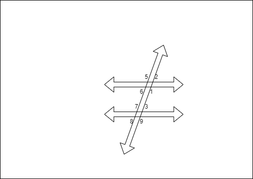

# Angle relationships

## Vertical Angles

Vertical angles are pairs of opposite angles made by intersecting lines.

If 2 angles are vertical then they are congruent.

## Complementary

The sum of complementary angles are 90 degrees.

## supplementary

The sum of supplementary angles are 180 degrees.

## Linear pairs

## Same Side Interior

In this case angle 1 and 3 are equal, as well as 2 and 4 are equal. Same side interior has to add up to 180 degrees. 

## Corresponding angles

Angle 1= Angle 9
Angle 2= Angle 3
Angle 5= Angle 7
Angle 8= Angle 6

Angles are congruent corresponding angles.

## Alternate interior

Angle 1= Angle 2
Angle 3= Angle 4

Angles are congruent

## Alternate exterior

Angle 1= Angle 2
Angle 3= Angle 4

Angles are congruent

## Obtuse and Acute

Obtuse means more than 90. Acute means less then 90. Obtuse plus acute equals 180.