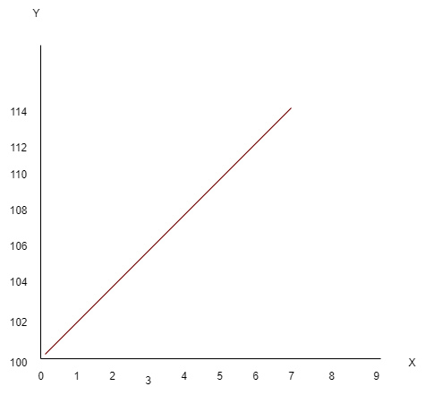
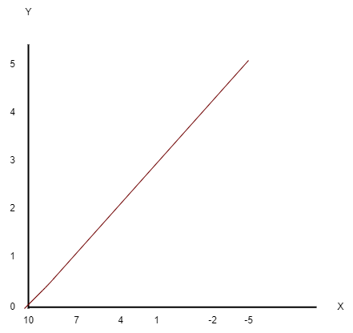

# Linear equations

## Definition
 In a linear equation, y is the dependent variable and x is the independent variable. Y is being measured and x is being manipulated. ( y = x....)

### Example 1
 Let's say that a banana company sells a bananas for $2 each. X is the amount of bananas and y is the amount of money.

This is how a graph for this would look like.

In this case, y=2x

### Example 2
Now, a desert is 100 degrees, every our for 7 hours, the temperature will increase by 2 degrees.

The graph will look like this.

So the equation is y=100+2x.

### Example 3
In Ninja school there are 7 belts from white to black. To get a belt you need to attain at least 8 classes. The gym membership is $50 and each lesson is $30.
How much will it cost to get those belts.

Y=50+30x

### Example 4

x | 0 | 1 | 2 | 3 | 4 | 5 |
--|--|--|--|--|--|--|
y | 10 | 7 | 4 | 1 | -2| -5

Y=10-3x

