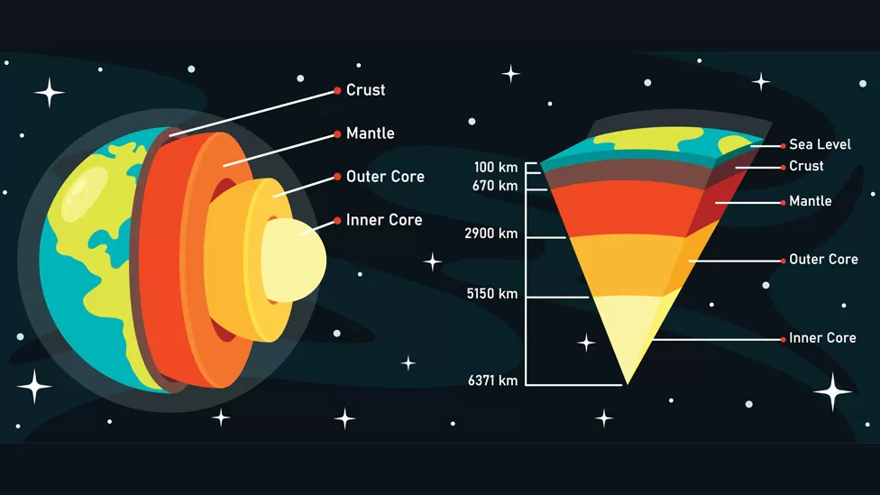

# The earths layers

The crust and the mantle make up the lithosphere, and the atmosphere is between the upper mantle and lower mantle.

Earths core is made up of iron and nickel and is very hot. The inner core has an outer liquid layer and an inner solid layer.
 
Humans walk above the crust, that's where the land and sea is. The tectonic plates come from the lithosphere.