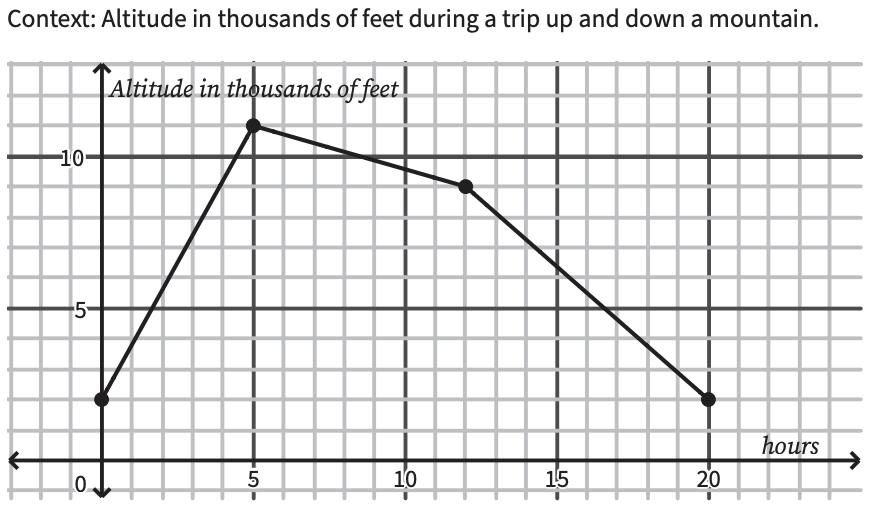

# Interval Notation

## Example 1

{(5,-1)(-5,-1)(2,-4)}

This is a function because there isn't more of the same number for x.

Domain:{-5,2,5}
The domain is always the x values put in order of least to greatest.

Range:{-4,-1}
The range is always the y values put in order of least to greatest.

## Example 2

### Where does the function increase?

When you are asked this question you have to pay attention to the x values. The answer to this question is [0,5). 0 to 5 are the only coordinates that have increased in between, while all the others are decreasing.

### Where does the function decrease?

You use the x values again in this example. The answer is [5,20].