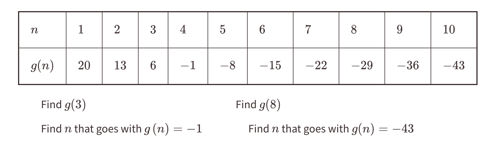

# Recursive and Explicit functions

## Introduction
Sometimes you will get patterns like the one below.

There are certain types of equations called explicit and recursive equations. They are both equations to express a pattern. They use the common difference and starting value of a pattern. For example, in the image above, the starting value is 27. You may think that it's really 20 at first, but its not. The starting value is when x (or n in this case) is 0. Since the pattern is going down by 7, you need to add 7 to 20, so that you get the starting value.
The common difference is the pattern. In this image, the common difference is -7, because the y value is always decreasing by 7.

### Explicit equations
This equation is the easiest out of the two. But it can change depending on whether its a geometric function or arithmetic function. The difference between the two is that geometric functions are patterns that change by dividing or multiplying. Arithmetic functions are from adding or subtracting.

Explicit equations during geometric functions example: f(x)=27-7x
Explicit equations during arithmetic functions example: f(x)=7x+27

### Recursive equations
This equation is a bit harder since it is longer. It always stays the same whether its arithmetic or geometric.

Recursive equations during geometric functions example: f(x)=f(x-1)-7,f(0)=27
Recursive functions during arithmetic functions example: f(x)=f(x-1)-7,f(0)=27
