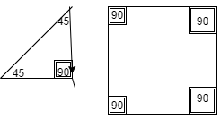
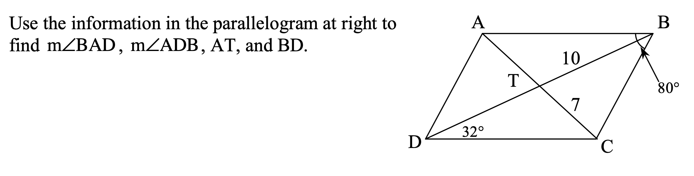
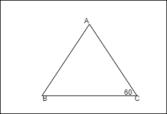

# Shapes

## What are the lines of symmetry in a shape?

The lines of symmetry in a shape are lines that show where the shape can be folded and be even on both folded sides. A shape can have many lines of symmetry. For example, a square has 4 lines of symmetry because it can be folded in 4 places and still look the same on both folded sides.

## What are the diagonals of a shape?

In order for a shape to have diagonals it needs to have at least 4 sides. Diagonals are when vertices have opposite vertices and lines can connect them.

## How to find the sum of angles in a shape

Look at all the angles and add them up. A square would be 360 and a triangle would be 180.

## What is an isosceles Triangle?
An isosceles triangle is a triangle with two equal sides and one not equal.

 ## How to find measurment

 We know that sum of all angles of a square is 360 degrees, so that will help us to find the answer to our problem. The image is showing that one of the angles in this parallelogram is 80 degrees. If we want to find m∠BAD, we basically need to know the angle of the middle letter, which in this case, is A. If B is 80 degrees, then the opposite angle of the vertice, which is D, is also 80 degrees. That means B and D together are 160 degrees. 360 minus 160 is 200. This means A and C are both part of that 200. So each one is 100 degrees. Now we know A is 100 degrees.

 ### Another measurement example
 
 In this example, you do the same thing. The sum of all angles for a triangle is 180. Since there are three sides in this shape, you need to divide the sum, 180, by 3, that is 60. so if we want to solve m∠ABC, it would be 60 degrees because that is what B is. In fact, any order of those letters would be the same.