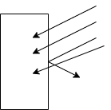

# Light

## Different light interactions

### Reflection

Refection happens when light hits a smooth surface.

### Scattering

Scattering happens when light hits a rough surface.

### Transmission

Transmission happens when at least some light passes through an object. Some light is absorbed which affects tint.

### Why we see colors

Colors are seen when an object absorbs all wave lengths of color except the color that you are seeing which is being reflected/scattered.

### Absorption

Absorption occurs when an object absorbs light rays. Not all rays are usually absorbed by materials.
